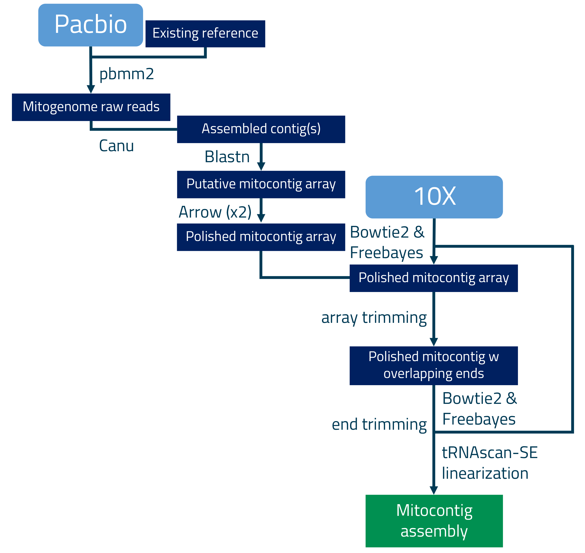

# mitoVGP
This repository contains scripts used to generate mitochondrial sequences for the <a href="http://www.vertebrategenomesproject.org">Vertebrate Genomes Project</a>.

<b>Software and Data Use Policy</b>

mitoVGP is distributed under the <a href="LICENSE.txt">BSD 3-Clause License</a>.

VGP samples and data come from a variety of sources. To support fair and productive use of this data, please abide by the <a href="https://genome10k.soe.ucsc.edu/data-use-policies/">Data Use Policy</a> and contact us with any questions.

<b>Content Description:</b>

- canu-1.8.Linux-amd64.tar.xz - the popular long read assembler employed in the pipeline

- mitoVGP_conda_env.yml - conda environment containing all software required to run the pipeline on Linux

- mitoVGP - the pipeline

- scripts/ - the intermediate scripts required by mitoVGP

<b>Quick Start</b>

mitoVGP is available for Linux64 and requires <a href="https://docs.conda.io/projects/conda/en/latest/user-guide/install/#regular-installation">Conda</a>. To install and run follow these instructions:

```
git clone https://github.com/gf777/mitoVGP.git #clone this git repository
cd mitoVGP #get into mitoVGP folder

tar -xvf canu-1.8.Linux-amd64.tar.xz #install canu assembler
rm canu-1.8.Linux-amd64.tar.xz

conda env create -f mitoVGP_conda_env.yml #install mitoVGP conda environment
#Note: as alternative to mitoVGP_conda_env.yml you may try 
#mitoVGP_conda_env_nobuilds.yml to maximize compatibility.

conda activate mitoVGP #activate mitoVGP conda environment

#run mitoVGP pipeline using 24 cores (example with M. armatus)
./mitoVGP -s Mastacembelus_armatus -i fMasArm1 -r mtDNA_Mastacembelus_armatus.fasta -t 24
```

For additional options and specifications you can type:
```
sh mitoVGP.sh -h
```

<b> Pipeline workflow </b>

An existing reference from closely to distantly related species is used to identify mito-like reads in pacbio WGS data, which are then employed in <i>de novo</i> genome assembly. The assembly is further polished using both long and short read data, and linearized to start with the conventional Phenylalanine tRNA.



To date, mitogenomes assembled using mitoVGP pipeline are:

<i>
Alca torda<br/>
Amblyraja radiata<br/>
Anabas testudineus<br/>
Archocentrus centrarchus<br/>
Arvicanthis niloticus<br/>
Astatotilapia calliptera<br/>
Balearica regulorum<br/>
Callithrix jacchus<br/>
Calypte anna <br/>
Chiroxiphia lanceolata<br/>
Choloepus didactylus<br/>
Cuculus canorus<br/>
Dendropsophus ebraccatus<br/>
Dermochelys coriacea<br/>
Gopherus evgoodei <br/>
Gopherus flavomarginatus<br/>
Gouania willdenowi <br/>
Homo sapiens<br/>
Lemur catta<br/>
Lynx canadensis<br/>
Mastacembelus armatus<br/>
Melopsittacus undulatus<br/>
Ornithorhynchus anatinus<br/>
Phyllostomus discolor<br/>
Pristis pectinata<br/>
Pterocles gutturalis<br/>
Rhinatrema bivittatum<br/>
Rhinolophus ferrumequinum<br/>
Strigops habroptilus<br/>
Taeniopygia guttata</i> (x2) <i><br/>
Tursiops truncatus
</i>

