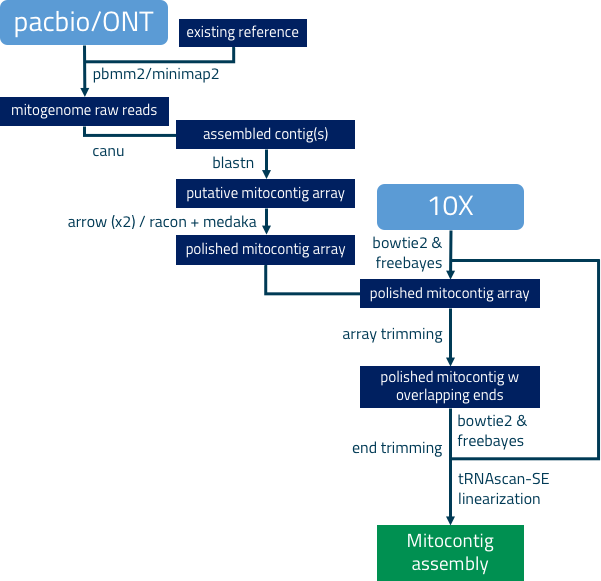

# mitoVGP 2.2
This repository contains scripts used to generate mitochondrial sequences for the <a href="http://www.vertebrategenomesproject.org">Vertebrate Genomes Project</a>.

<b>Software and Data Use Policy</b>

mitoVGP is distributed under the <a href="LICENSE.txt">BSD 3-Clause License</a>.

VGP samples and data come from a variety of sources. To support fair and productive use of this data, please abide by the <a href="https://genome10k.soe.ucsc.edu/data-use-policies/">Data Use Policy</a> and contact us with any questions.

If you use mitoVGP or any of the mitogenomes generated by the VGP please cite:

Formenti, G., Rhie, A., Balacco, J. et al. Complete vertebrate mitogenomes reveal widespread repeats and gene duplications. Genome Biol 22, 120 (2021). https://doi.org/10.1186/s13059-021-02336-9

<b>Content Description:</b>

- canu-1.8.Linux-amd64.tar.xz - the popular long read assembler employed in the pipeline

- mitoVGP_conda_env_pacbio.yml - conda environment containing all software required to run the pipeline with Pacbio data on Linux

- mitoVGP_conda_env_ONT.yml - conda environment containing all software required to run the pipeline with ONT data on Linux

- mitoVGP - the pipeline

- scripts/ - the intermediate scripts required by mitoVGP

<b>Quick Start</b>

mitoVGP is available for Linux64 and requires <a href="https://docs.conda.io/projects/conda/en/latest/user-guide/install/#regular-installation">Conda</a>. To install and run follow these instructions:

```
git clone https://github.com/gf777/mitoVGP.git #clone this git repository
cd mitoVGP #get into mitoVGP folder

tar -xvf canu-1.8.Linux-amd64.tar.xz #install canu assembler
rm canu-1.8.Linux-amd64.tar.xz

#create the mitoVGP pipeline software environment
#please note: Pacbio software only runs on Python 2, while ONT software requires Python 3,
#therefore two different environments must be set depending on data type.
#Pacbio:
conda env create -f mitoVGP_conda_env_pacbio.yml
#ONT:
conda env create -f mitoVGP_conda_env_ONT.yml

conda activate mitoVGP_pacbio #activate mitoVGP conda environment, use mitoVGP_ONT for Nanopore datasets

#run mitoVGP pipeline using 24 cores (example with M. armatus, Pacbio and 10x data)
./mitoVGP -a pacbio -s Mastacembelus_armatus -i fMasArm1 -r mtDNA_Mastacembelus_armatus.fasta -t 24 -b variantCaller
```

For additional options and specifications you can type:
```
./mitoVGP -h
```

Please note that depending on your Pacbio chemistry you will need to define a different polishing tool.
For chemistry 2.0 (default):
```
./mitoVGP -b gcpp
```
For chemistry lower than 2.0 use:
```
./mitoVGP -b variantCaller
```
For RSII chemistries you may also want to align reads using blasr:
```
./mitoVGP -b variantCaller -m blasr
```


<b> Pipeline workflow </b>

An existing reference from closely to distantly related species is used to identify mito-like reads in pacbio/ONT WGS data, which are then employed in <i>de novo</i> genome assembly. The assembly is further polished using both long and short read data, and linearized to start with the conventional Phenylalanine tRNA sequence.

<p align="center">
	
</p>

VGP mitogenomes assembled using mitoVGP pipeline can be found on <a href="https://vgp.github.io/genomeark/">GenomeArk</a> and include:

<b>Pacbio</b><br/>
Anna's hummingbird (<i>Calypte anna</i>)<br/>
Atlantic Halibut (<i>Hippoglossus hippoglossus</i>)<br/>
Atlantic horse mackerel (<i>Trachurus trachurus</i>)<br/>
Blue Whale (<i>Balaenoptera musculus</i>)<br/>
Blunt-snouted clingfish (<i>Gouania willdenowi</i>)<br/>
Boesman’s rainbowfish (<i>Melanotaenia boesemani</i>)<br/>
Bolson tortoise (<i>Gopherus flavomarginatus</i>)<br/>
Bottlenose dolphin (<i>Tursiops truncatus</i>)<br/>
Brown rat (<i>Rattus norvegicus</i>)<br/>
Brown trout (<i>Salmo trutta</i>)<br/>
Budgerigar (<i>Melopsittacus undulatus</i>)<br/>
Californian Sea Lion (<i>Zalophus californianus</i>)<br/>
Canada Lynx (<i>Lynx canadensis</i>)<br/>
Carmine Bee-eater (<i>Merops nubicus</i>)<br/>
Chicken (<i>Gallus gallus</i>)<br/>
Chimpanzee (<i>Pan troglodytes</i>)<br/>
Climbing perch (<i>Anabas testudineus</i>)<br/>
Common brushtail possum (<i>Trichosurus vulpecula</i>)<br/>
Common Cuckoo (<i>Cuculus canorus</i>)<br/>
Common marmoset (<i>Callithrix jacchus</i>)<br/>
Common pipistrelle (<i>Pipistrellus pipistrellus</i>)<br/>
Common starfish (<i>Asterias rubens</i>)<br/>
Common Tern (<i>Sterna hirundo</i>)<br/>
Common Yellowthroat (<i>Geothlypis trichas</i>)<br/>
Copperband butterflyfish (<i>Chelmon rostratus</i>)<br/>
Cow (Angus/Braham Hybrid) (<i>Bos taurus</i>)<br/>
Denticle herring (<i>Denticeps clupeoides</i>)<br/>
Downy Woodpecker (<i>Dryobates pubescens</i>)<br/>
Eastern happy (<i>Astatotilapia calliptera</i>)<br/>
Electric eel (<i>Electrophorus electricus</i>)<br/>
Eurasian Golden Plover (<i>Pluvialis apricaria</i>)<br/>
Eurasian otter (<i>Lutra lutra</i>)<br/>
Eurasian red squirrel (<i>Sciurus vulgaris</i>)<br/>
European common frog (<i>Rana temporaria</i>)<br/>
European golden eagle (<i>Aquila chrysaetos</i>)<br/>
European Toad (<i>Bufo bufo</i>)<br/>
Flier cichlid (<i>Archocentrus centrarchus</i>)<br/>
Gaboon caecilian (<i>Geotrypetes seraphini</i>)<br/>
Gilthead seabream (<i>Sparus aurata</i>)<br/>
Goode's Thornscrub tortoise (<i>Gopherus evgoodei</i>)<br/>
Great Potoo (<i>Nyctibius grandis</i>)<br/>
Great white shark (<i>Carcharodon carcharias</i>)<br/>
Greater Horseshoe Bat (<i>Rhinolophus ferrumequinum</i>)<br/>
Greater Mouse-Eared Bat (<i>Myotis myotis</i>)<br/>
Greater pipefish (<i>Syngnathus acus</i>)<br/>
Grey crowned-crane (<i>Balearica regulorum</i>)<br/>
Grey squirrel (<i>Sciurus carolinensis</i>)<br/>
Gyrfalcon (<i>Falco rusticolus</i>)<br/>
Honeycomb rockfish (<i>Sebastes umbrosus</i>)<br/>
Hourglass Treefrog (<i>Dendropsophus ebraccatus</i>)<br/>
Human (<i>Homo sapiens</i>)<br/>
Indian glassy fish (<i>Parambassis ranga</i>)<br/>
Indo-pacific tarpon (<i>Megalops cyprinoides</i>)<br/>
Japanese puffer (Torafugu) (<i>Takifugu rubripes</i>)<br/>
John dory (<i>Zeus faber</i>)<br/>
Kakapo (<i>Strigops habroptilus</i>)<br/>
Korean giant-fin mudskipper (<i>Periophthalmus magnuspinnatus</i>)<br/>
Kuhl's Pipistrelle (<i>Pipistrellus kuhlii</i>)<br/>
Largescale Four-Eyed Fish (<i>Anableps anableps</i>)<br/>
Leatherback Sea Turtle (<i>Dermochelys coriacea</i>)<br/>
Lesser kestrel (<i>Falco naumanni</i>)<br/>
Linnaeus's Two Toed Sloth (<i>Choloepus didactylus</i>)<br/>
Live sharksucker (<i>Echeneis naucrates</i>)<br/>
Lumpfish (<i>Cyclopterus lumpus</i>)<br/>
Maguari Stork (<i>Ciconia maguari</i>)<br/>
Mute Swan (<i>Cygnus olor</i>)<br/>
Needlefish (<i>Xenentodon cancila</i>)<br/>
New Caledonian crow (<i>Corvus moneduloides</i>)<br/>
Nile rat (<i>Arvicanthis niloticus</i>)<br/>
Northern pike (<i>Esox lucius</i>)<br/>
Pale spear-nosed Bat (<i>Phyllostomus discolor</i>)<br/>
Platypus (<i>Ornithorhynchus anatinus</i>)<br/>
Razorbill (<i>Alca torda</i>)<br/>
Red-bellied piranha (<i>Pygocentrus nattereri</i>)<br/>
Red-fronted tinkerbird (<i>Pogoniulus pusillus</i>)<br/>
Red-legged Seriema (<i>Cariama cristata</i>)<br/>
Reedfish (<i>Erpetoichthys calabaricus</i>)<br/>
Rifleman (<i>Acanthisitta chloris</i>)<br/>
Ring-tailed lemur (<i>Lemur catta</i>)<br/>
Sand lizard (<i>Lacerta agilis</i>)<br/>
Sea Lamprey (<i>Petromyzon marinus</i>)<br/>
Short-beaked echidna (<i>Tachyglossus aculeatus</i>)<br/>
Smalltooth sawfish (<i>Pristis pectinata</i>)<br/>
Southern tamandua (<i>Tamandua tetradactyla</i>)<br/>
Spotted scat (<i>Scatophagus argus</i>)<br/>
Spotty Wrasse (<i>Notolabrus celidotus</i>)<br/>
Sterlet (<i>Acipenser ruthenus</i>)<br/>
Stoat (<i>Mustela erminea</i>)<br/>
Swainson's thrush (<i>Catharus ustulatus</i>)<br/>
Thorny Skate (<i>Amblyraja radiata</i>)<br/>
Tiny Cayenne Caecilian (<i>Microcaecilia unicolor</i>)<br/>
Tire track eel (<i>Mastacembelus armatus</i>)<br/>
Two-lined caecilian (<i>Rhinatrema bivittatum</i>)<br/>
Vaquita (<i>Phocoena sinus</i>)<br/>
Warty Frogfish (<i>Antennarius maculatus</i>)<br/>
Whiskered Treeswift (<i>Hemiprocne comata</i>)<br/>
Yellow-throated Sandgrouse (<i>Pterocles gutturalis</i>)<br/>
Zebra Finch (female) (<i>Taeniopygia guttata</i>)<br/>
Zebra Finch (male) (<i>Taeniopygia guttata</i>)<br/>
Zebrafish SAT strain (<i>Danio rerio</i>)<br/>

<br/>

<b>Nanopore</b><br/>
Spotty Wrasse	(<i>Notolabrus celidotus</i>)<br/>
Thorny Skate	(<i>Amblyraja radiata</i>)<br/>
Hourglass Treefrog	(<i>Dendropsophus ebraccatus</i>)<br/>
Sand lizard	(<i>Lacerta agilis</i>)<br/>
